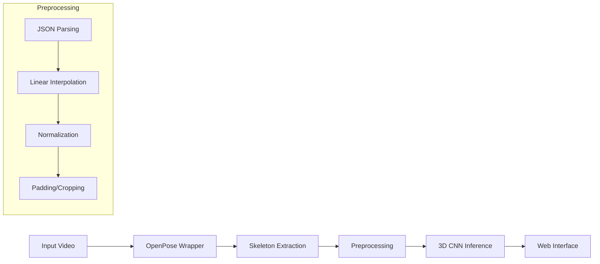

# KTP Action Recognition AI

A state-of-the-art Human Action Recognition system that combines **OpenPose** for skeleton extraction and a custom **3D CNN (ResNet3D)** for temporal action classification. The system features a modern web interface for real-time video analysis and visualization.

## 🚀 Features

*   **Real-time Analysis**: Upload any video to get instant action classification.
*   **Visual Feedback**: See exactly what the AI sees with a dynamic skeleton overlay on your video.
*   **High Accuracy**: Uses a 3D ResNet architecture with Squeeze-and-Excitation (SE) blocks.
*   **Robustness**: Handles missing data using linear interpolation to fix occlusion issues (e.g., missing legs).
*   **Modern UI**: Built with React, Tailwind CSS, and shadcn/ui for a premium user experience.

## 🏗️ Architecture

The system follows a modular pipeline architecture:



### Tech Stack

*   **Core**: Python 3.9+, PyTorch
*   **Skeleton Extraction**: OpenPose (BODY_25 Model)
*   **Backend**: FastAPI (Async, High Performance)
*   **Frontend**: React, Vite, Tailwind CSS
*   **Data Processing**: OpenCV, NumPy

## 🛠️ Setup & Installation

### Prerequisites
*   Windows 10/11 (with NVIDIA GPU recommended)
*   Conda
*   Node.js (LTS)
*   OpenPose Binaries (placed in `openpose/` folder)

### 1. Backend Setup
Open a terminal in the project root:

```cmd
conda create -n KTP-TASK python=3.9
conda activate KTP-TASK
pip install -r requirements.txt
```

### 2. Frontend Setup
Open a new terminal in `frontend/`:

```cmd
cd frontend
npm install
```

## 🏃‍♂️ Usage

### Training the Model (Optional)
If you want to retrain the model on the KTH dataset:

```cmd
python train.py
```
*   This will process data from `Skeletons/`, train the 3D CNN, and save `best_model.pth`.

### Running the Application
You need two terminals running simultaneously.

**Terminal 1: Backend**
```cmd
conda activate KTP-TASK
python backend/main.py
```

**Terminal 2: Frontend**
```cmd
cd frontend
npm run dev
```

Open your browser to the URL shown (usually `http://localhost:5173`) and upload a video!

## 📂 Project Structure

*   `backend/`: FastAPI server and static file serving.
*   `frontend/`: React application source code.
*   `openpose/`: OpenPose binaries and models.
*   `Data/`: Raw KTH dataset videos.
*   `Skeletons/`: Extracted .npy skeleton files.
*   `dataset.py`: PyTorch Dataset class with augmentation and interpolation.
*   `model.py`: 3D CNN Architecture definition.
*   `train.py`: Training loop and validation logic.
*   `inference.py`: Inference pipeline and video rendering.
*   `video_to_keypoints.py`: Wrapper for OpenPose execution.

## 📝 License
This project is for educational and research purposes.
